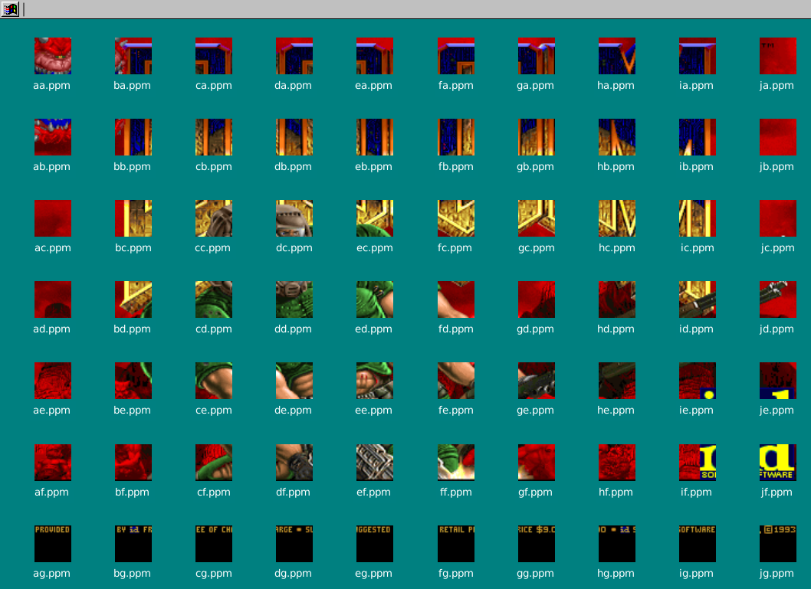

# DOOM-Xfce-Desktop



**DOOM on your desktop!**

Source-port of [doomgeneric](https://github.com/ozkl/doomgeneric). Does not have sound.

You will need a WAD file (game data). If you don't own the game, the shareware version is freely available.

## Build

Ensure you are using xfce4, and have clang and glib-2.0 installed. Execute the following commands to create `src/doom_desktop`.

```
cd src
make
```

## Documentation

#### Desktop

Files containing the `[` and `]` characters on your desktop will lead to unexpected behaviour.

#### Command-line arguments

`-res <int>`: Sets the resolution of the image files. Recommended in range 24-64.

`-delay <int>`: Sets the delay between frames (in ms). Increase the delay if thumbnails aren't loading. Default: 400

#### Input

To toggle one of the game's inputs, execute the appropriate bash script that is located under the game's display. This can typically be done by simply double-clicking on them.

#### Quitting

To terminate the program, send the SIGINT signal once (e.g. by pressing `C-c`) and wait 1 second.

#### Reviving your DE

Xfce can sometimes hang during the program's execution. To fix it, terminate the program, then call
```
pkill xfdesktop
xfdesktop &
```
